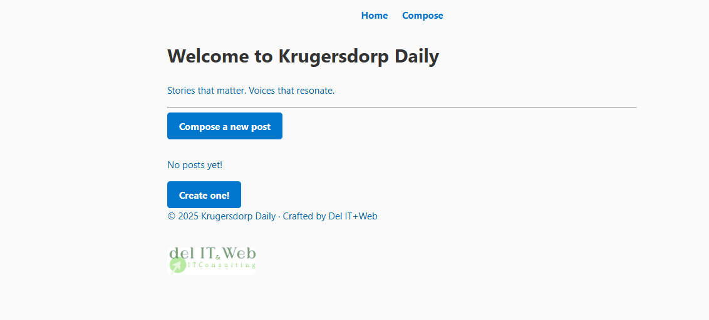
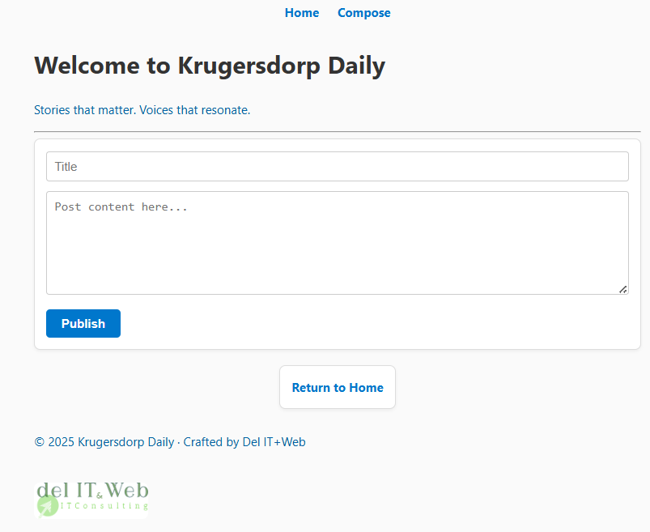

# Purpose & Perspective - Personal Reflection Blog

A thoughtful, full-stack blog application built with Node.js, Express, MongoDB, and EJS templating. This personal reflection platform shares insights on life, growth, and finding meaning, designed as an extension of my professional portfolio at delitweb.co.za. The app includes intelligent fallback storage and automatic database reconnection to ensure it stays online even when the database is unavailable.

> *A personal space for sharing insights on purpose, growth, and meaningful living.*

## Architecture Overview

```
┌─────────────────────────────────────────────────────────────┐
│                    CLIENT (Browser)                         │
│                                                             │
│  ┌─────────────┐  ┌─────────────┐  ┌─────────────┐        │
│  │    Home     │  │   Compose   │  │    Posts    │        │
│  │   Page      │  │    Page     │  │    Pages    │        │
│  └─────────────┘  └─────────────┘  └─────────────┘        │
└─────────────────────────────────────────────────────────────┘
                              │
                              ▼ HTTP Requests
┌─────────────────────────────────────────────────────────────┐
│                   EXPRESS SERVER                            │
│                                                             │
│  ┌─────────────┐  ┌─────────────┐  ┌─────────────┐        │
│  │   Routes    │  │ Middleware  │  │   Static    │        │
│  │  Handler    │  │   Layer     │  │   Assets    │        │
│  └─────────────┘  └─────────────┘  └─────────────┘        │
│                              │                              │
│  ┌─────────────────────────────────────────────────────┐   │
│  │          CONNECTION MANAGEMENT                       │   │
│  │                                                     │   │
│  │  ┌─────────────┐  ┌─────────────┐  ┌─────────────┐ │   │
│  │  │  MongoDB    │  │  Fallback   │  │ Auto-Retry  │ │   │
│  │  │   Check     │  │  Storage    │  │   Logic     │ │   │
│  │  └─────────────┘  └─────────────┘  └─────────────┘ │   │
│  └─────────────────────────────────────────────────────┘   │
└─────────────────────────────────────────────────────────────┘
                              │
                              ▼
┌─────────────────────────────────────────────────────────────┐
│                    DATA LAYER                               │
│                                                             │
│  ┌─────────────────────┐       ┌─────────────────────┐     │
│  │   MongoDB Atlas     │  OR   │   In-Memory Array   │     │
│  │  (Persistent Data)  │       │  (Temporary Data)   │     │
│  └─────────────────────┘       └─────────────────────┘     │
└─────────────────────────────────────────────────────────────┘
```

## Project Structure

```
BLOG WebApp/
├── index.js                   # Main server file
├── package.json               # Dependencies & scripts
├── README.md                  # This documentation
├── models/
│   └── Post.js                # MongoDB schema definition
├── views/                     # EJS templates
│   ├── index.ejs              # Homepage template
│   ├── compose.ejs            # New post creation
│   ├── posts.ejs              # Individual post view
│   ├── edit.ejs               # Post editing interface
│   └── partials/
│       ├── header.ejs         # Shared header with navigation
│       └── footer.ejs         # Shared footer
└── public/
    ├── styles/
    │   └── main.css           # Application styling
    └── images/                # Static assets
```

## Tech Stack

### Core Technologies
- **Node.js + Express**: Backend server and routing
- **MongoDB Atlas + Mongoose**: Cloud database with ODM
- **EJS**: Server-side templating engine
- **UUID**: Unique identifier generation for fallback storage
- **Body-parser**: Form data handling middleware

### Frontend
- **HTML5/CSS3**: Responsive design via `/public` folder
- **EJS Partials**: Modular header/footer components
- **Dynamic Forms**: Create, edit, and delete functionality

## Intelligent Fallback System

This application features a unique dual-storage architecture that ensures 100% uptime. If MongoDB is unavailable, the app automatically switches to in-memory storage so users can still create and manage posts.

```javascript
// Automatic MongoDB detection and fallback
async function connectToMongoDB() {
  try {
    await mongoose.connect(mongoURI);
    isMongoConnected = true;  // Use MongoDB
    console.log("Connected to MongoDB Atlas");
  } catch (err) {
    isMongoConnected = false; // Use fallback storage
    console.log("MongoDB unavailable, switching to local storage");
    // Auto-retry every 30 seconds (max 5 attempts)
    setTimeout(connectToMongoDB, 30000);
  }
}

// Every route uses this pattern for maximum reliability
app.get("/", async (req, res) => {
  try {
    const posts = isMongoConnected 
      ? await Post.find().sort({ createdAt: -1 })  // Cloud data
      : fallbackPosts.sort((a,b) => new Date(b.createdAt) - new Date(a.createdAt)); // Local data
    
    res.render("index", { posts, isMongoConnected });
  } catch (err) {
    // Triple-layer protection: even if both fail, app still works
    res.render("index", { posts: [], isMongoConnected: false });
  }
});
```

### How It Works
1. **App starts** and attempts MongoDB connection
2. **Success** - All operations use MongoDB Atlas (persistent)  
3. **Failure** - Seamlessly switches to in-memory arrays (temporary)
4. **Auto-recovery** - Retries connection every 30 seconds
5. **User notification** - Status banner shows current mode
6. **Zero downtime** - Users can always create/edit posts

## Screenshots

**Homepage with Connection Status**
  

**Post Editing Interface**
  

**Compose New Post**
  

## What I Learned Building This

### Technical Skills
- **Dynamic Routing**: Mastered `req.params` for RESTful URLs (`/posts/:id`)
- **Form Processing**: POST request handling with body-parser middleware
- **Template Engineering**: EJS partials, includes, and conditional rendering
- **Error Handling**: Multi-layer fallback systems and graceful degradation
- **Database Integration**: MongoDB Atlas connection with Mongoose ODM
- **System Architecture**: Dual-storage patterns for maximum reliability

### Problem-Solving Breakthroughs
- **Connection Management**: Auto-retry logic with exponential backoff
- **User Experience**: Real-time status notifications and seamless failover
- **Code Organization**: Modular route handlers and reusable components
- **Debugging**: Control flow analysis and rendering troubleshooting

## Quick Start

### Prerequisites
- Node.js v18+ installed
- MongoDB Atlas account (optional - app works without it!)

### Installation & Setup
```bash
# Clone and navigate to project
cd BLOG-WebApp

# Install dependencies
npm install

# Start the application
node index.js
```

### First Run Experience
```
Connecting to MongoDB Atlas...
Connected to MongoDB Atlas successfully!
Server running at http://localhost:3000

If MongoDB fails to connect:
MongoDB connection failed: network timeout
Reconnection attempt 1/5 in 30 seconds...
Running with in-memory storage - app fully functional!
```

**Visit**: `http://localhost:3000` and start blogging immediately!

## Project Status & Roadmap

### Completed Features
- **Persistent Storage**: MongoDB Atlas integration with Mongoose ODM
- **Intelligent Fallback**: In-memory storage for 100% uptime guarantee  
- **CRUD Operations**: Create, Read, Update, Delete posts with dual storage
- **Auto-Recovery**: Connection retry logic with health monitoring
- **User Notifications**: Real-time status banners for connection state
- **Responsive Design**: Mobile-friendly interface with modern CSS

### Next Steps
- **Public Deployment**: Deploy to Render/Vercel with production config
- **User Authentication**: Session-based login/logout with protected routes  
- **Testing Suite**: Unit and integration tests for route handlers
- **Analytics**: View tracking and popular posts dashboard
- **UI Enhancement**: Rich text editor and image upload support

### Long-term Goals
- **Multi-tenancy**: Support multiple blog instances
- **Mobile App**: React Native companion app
- **AI Integration**: Content suggestions and auto-tagging
- **SEO Optimization**: Meta tags and sitemap generation

## Documentation

### Complete Technical Guides
- **[Technical Architecture](TECHNICAL_ARCHITECTURE.md)**: Comprehensive system breakdown with code analysis
- **[Visual Flow Diagrams](VISUAL_FLOW_DIAGRAMS.md)**: ASCII diagrams and user journey flows

### API Endpoints
| Method | Endpoint | Description |
|--------|----------|-------------|
| `GET` | `/` | Homepage with all posts |
| `GET` | `/compose` | New post creation form |
| `POST` | `/compose` | Process new post submission |
| `GET` | `/posts/:id` | View individual post |
| `GET` | `/posts/:id/edit` | Edit post form |
| `POST` | `/posts/:id/edit` | Process post updates |
| `POST` | `/posts/:id/delete` | Delete post |

## Contributing

### Development Setup
```bash
# Fork the repository
git clone https://github.com/niyidukunda/webDev.git
cd webDev/Backend/BLOG-WebApp

# Create feature branch
git checkout -b feature/your-feature-name

# Make changes and test
npm install
node index.js

# Submit pull request
git push origin feature/your-feature-name
```

### Coding Standards
- **ES6+ syntax** with modern JavaScript features
- **Consistent naming**: camelCase for variables, PascalCase for models
- **Error handling**: Always implement try-catch with fallback paths
- **Documentation**: Comment complex logic and business rules

## License

This project is licensed under the **MIT License** - see the [LICENSE](LICENSE) file for details.

Feel free to use, modify, and distribute this code for personal or commercial projects. Attribution appreciated but not required.

## Acknowledgments

- **MongoDB Atlas**: For reliable cloud database hosting
- **Express.js Community**: For excellent documentation and middleware
- **EJS Template Engine**: For intuitive server-side rendering
- **GitHub Copilot**: For collaborative development insights

---

## Author

**Fidel Niyidukunda**  
*Full-Stack Developer & Founder of Del IT+Web*  

**Location**: Krugersdorp, South Africa  
**Portfolio**: [Del IT+Web](https://github.com/niyidukunda)  
**Contact**: [GitHub Profile](https://github.com/niyidukunda)  
**LinkedIn**: Connect for collaboration opportunities  

### Development Journey
I'm documenting my learning journey building real-world applications with modern web technologies. This blog app represents my progression from basic CRUD operations to enterprise-level architecture with fault tolerance and user experience optimization.

**Current Learning Focus**: Deployment optimization, user authentication systems, and advanced database design patterns.

---

*Built with Node.js, Express, MongoDB, and lots of coffee*# Trigger Vercel redeploy - 10/01/2025 10:09:40

