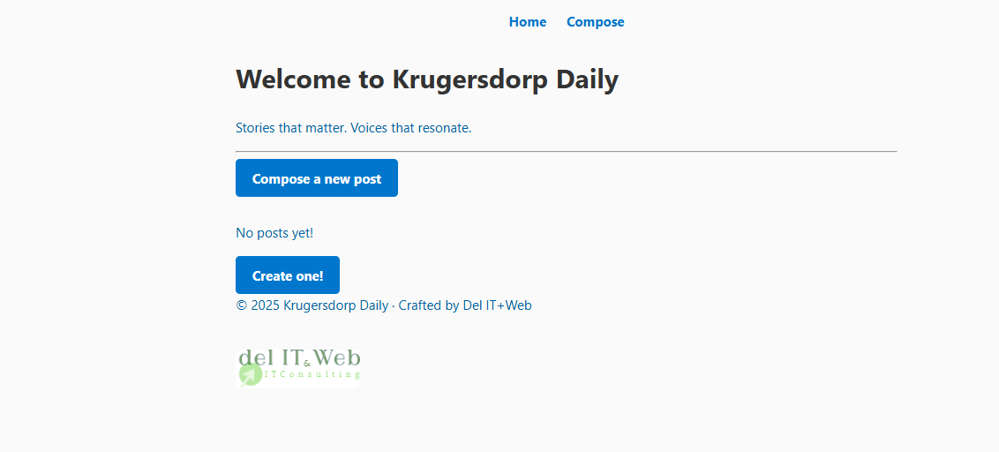
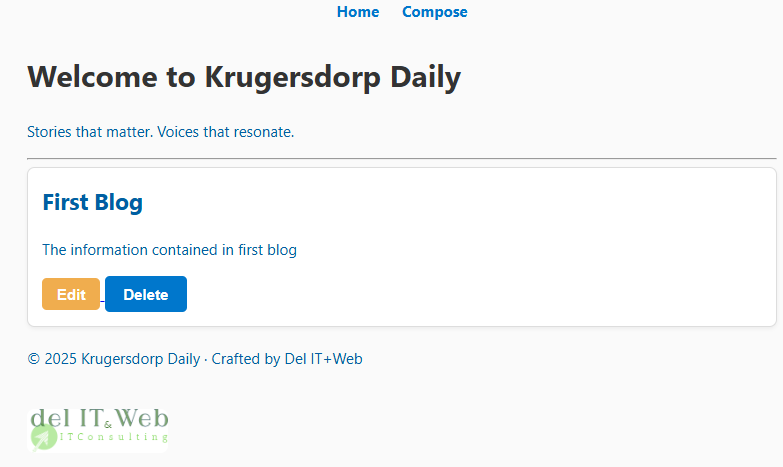
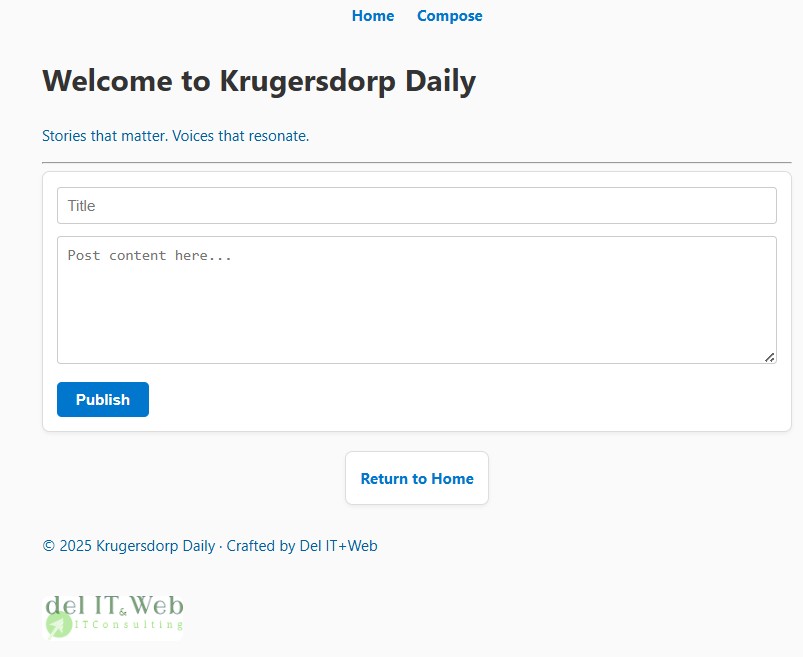

# Dynamic Blog App with Express & EJS

A minimalist blog platform built with Node.js and Express, featuring post creation, editing, deletion, and dynamic routing. Designed as part of my learning journey and startup portfolio at Del IT+Web.

## Features
- Create new blog posts
- View full post content via dynamic URLs
- Edit and delete posts
- In-memory data storage (no database yet)
- Clean EJS templating and semantic HTML

##  Tech Stack
- Node.js + Express
- EJS templating engine
- UUID for unique post IDs
- Body-parser for form handling
- HTML/CSS (via `/public` folder)

## Screenshots
_Add screenshots of homepage, compose form, post view, and edit form here._
  
  
  

## Learning Highlights
- Dynamic routing with `req.params`
- Form handling and data flow
- EJS templating and layout reuse
- Debugging control flow and rendering issues

##  Installation
```bash
npm install
node index.js

---

## What’s Next

- Add persistent storage (MongoDB or SQLite)
- Deploy the app publicly (Render or Vercel)
- Add user authentication and protected routes
- Refactor routes and add basic tests
- Document the learning journey in a public journal

##  Author

**Fidel Niyidukunda**  
Founder of Del IT+Web  
Krugersdorp, South Africa  
[GitHub Profile](https://github.com/YOUR_USERNAME)


